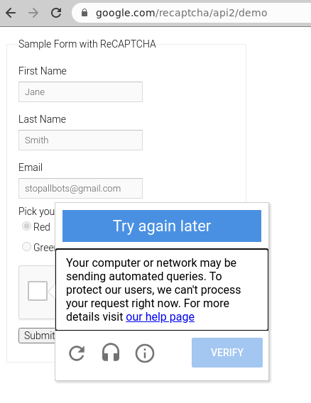

### YouTube Video Proof of Concept

I created a new YouTube Video with technical Explanation for breaking Google's Audio reCAPTCHAs:

[](https://www.youtube.com/watch?v=1kBmbEwJpYo)

Click on the image below to see the bot in action:

[](https://youtu.be/xh145UIeN9M)


### Conclusion

After a while, Google blocks you based on one of (or combination of):

1. Your IP address
2. Your Browser fingerprint
3. Your Browser JavaScript configuration if using headless browsers
4. Or the lack of human-like behavior such as mouse events or touch events

BUT: The Audio reCAPTCHA itself is completely, utterly broken. The normal, visual reCAPTCHA still works more or less. But it's a matter of time I guess.

**My estimation is: In 2021 and the near future, there is no other way to tell humans apart from bots than to:**

1. Record massive amounts of real human website behavior (mouse movements, scrolling, touch events, window resizing)
2. Train an advanced Artificial Neuronal Network with this data
3. And classify live behavioral data of website users

Kinda interesting times.

### Introduction

This repository uses the research work from the authors of [uncaptcha2](https://github.com/ecthros/uncaptcha2). 

The original scientific paper [can be found here](https://uncaptcha.cs.umd.edu/papers/uncaptcha_woot17.pdf).

The authors propose a method to solves Google's Audio ReCaptcha with Google's own Speech-to-Text API.

Yes you read that correctly: **It is possible to solve the Audio version of ReCaptcha v2 with Google's own [Speech-to-Text API](https://cloud.google.com/speech-to-text).**

Since the release of [uncaptcha2](https://github.com/ecthros/uncaptcha2) is from **Janunary 18, 2019**,
the Proof of Concept code does not work anymore (as the authors predicted correctly).

This repository attempts to keep the proof of concept up to date and working.

### Changes compared to uncaptcha2

#### Audio Download Option was removed 

The ReCaptcha audio download link does not work anymore, Google removed the download option.

Therefore, the audio download link has to be obtained via the Developer Console and a small JavaScript snippet.

If I am not mistaken, ReCaptcha sanctions the opening of dev tools.

Therefore, the better way is to start the chrome browser in debug mode and to obtain the audio download url via puppeteer and the chrome remote debug protocol. This method is implemented in the script `getCaptchaDownloadURL.js`. This method is currently used.

However, I fear that there are ways for ReCaptcha to detect if the browser is started in debug mode with the command line flag `--remote-debugging-port=9222`.

#### Randomized Mouse Movements

I randomized the mouse movements a bit and created random intermediate mouse movements before going to the target destination.

Regarding this, there is much more possible.

### Known Issues

Of course Google is not easily tricked. After all, ReCaptcha v3 is still based on ReCaptcha v2. When you think that ~~97%~~ 91% of all captchas can be solved with this method in production, I need to warn you:

Google is very reluctant to serve the audio captcha. After all, audio captchas are supposed to be solved by visually impaired people.

I assume that there is a simple counter for serving audio captchas. If more than X audio captchas were served, Google will simply block you.

Even if you are navigating as real human being to the audio captcha, you will often get banned by ReCaptcha. If you are not logged into the Google account, you will get very often the following error when attempting to solve the audio captcha:



I do not know how Google decides to block you, but I heavily assume that the very simple act of repeatingly prompting for the audio captcha is enough to become suspicious.

### Installation

The code was developed and tested on Ubuntu 18.04.

The following software needs to be installed:

```
aplay
chromium-browser
xclip
ffmpeg
curl
```

In order to install the Python 3.7 dependencies, create an virtual environment with `pipenv`:

```
# create pipenv
pipenv --python 3.7

# install dependencies
pipenv install -r requirements.txt

# create pipenv shell
pipenv shell
```

After those commands, the program `solveAudioCaptcha.py` may be executed:

```
python solveAudioCaptcha.py
```

### Adjust Coordinates

The captcha is solved with mouse pointer automation using the python module `pyautogui`.  Coordinates are used to automate the captcha solving.

Your setup very likely differs from my setup.

Therefore, you need to adjust the coordinates in `solveAudioCaptcha.py`.

You can also modify the `time.sleep()` calls in order to speed up or slow down the bot.
